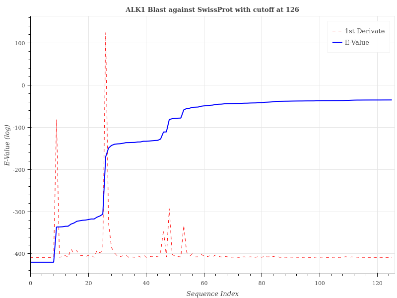
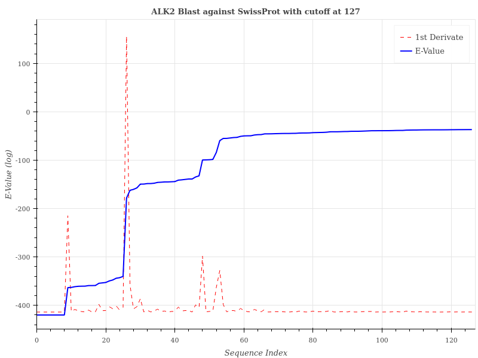
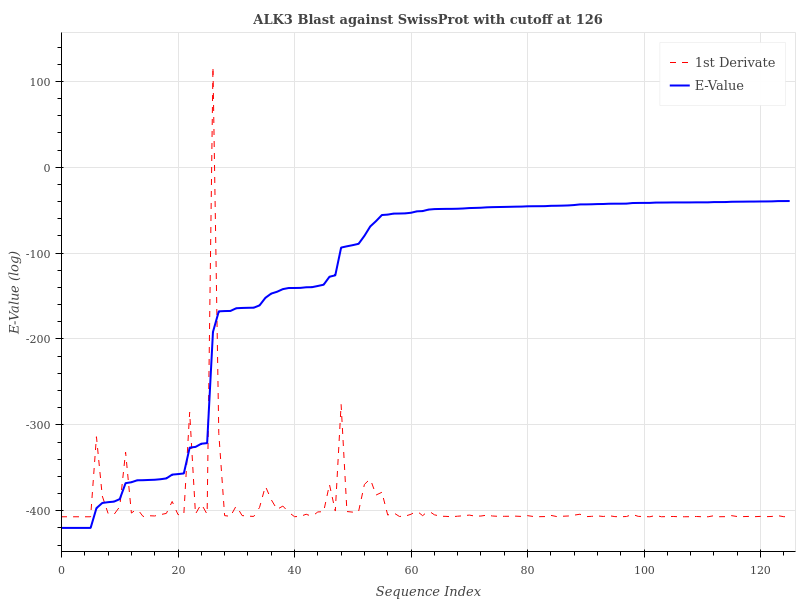
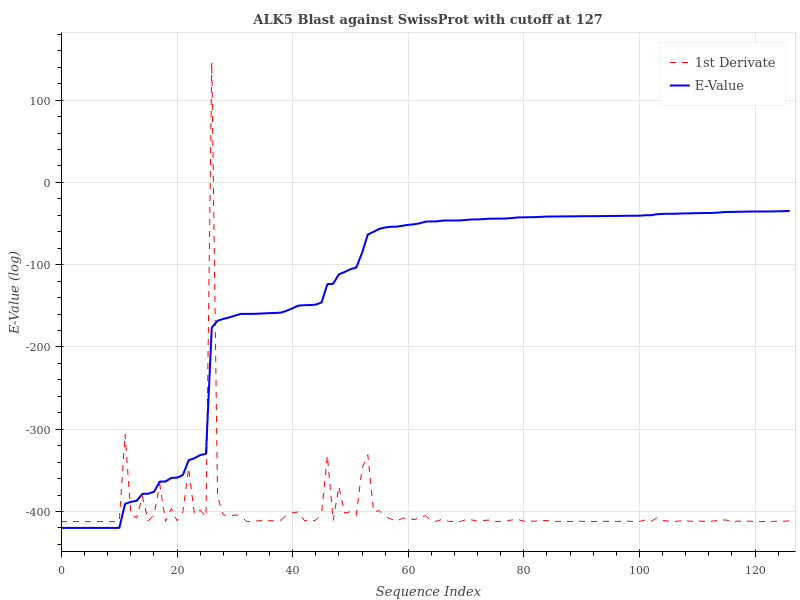
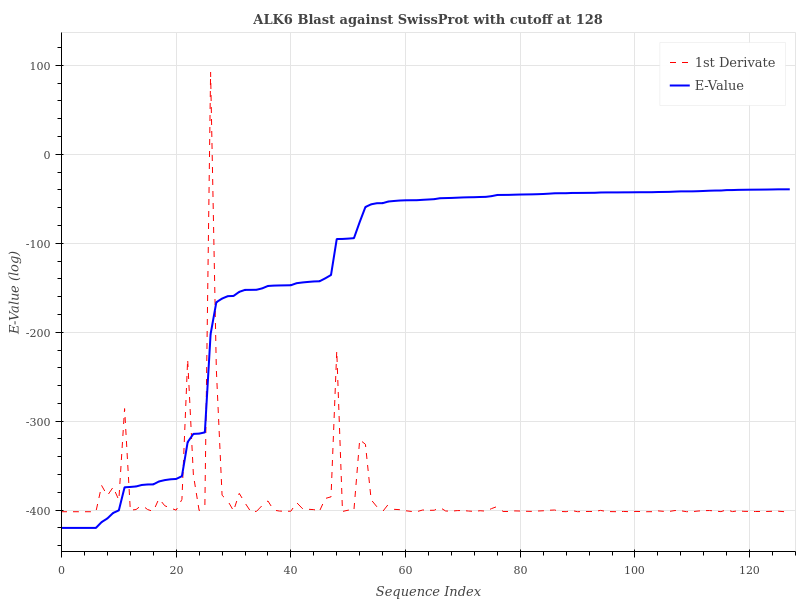
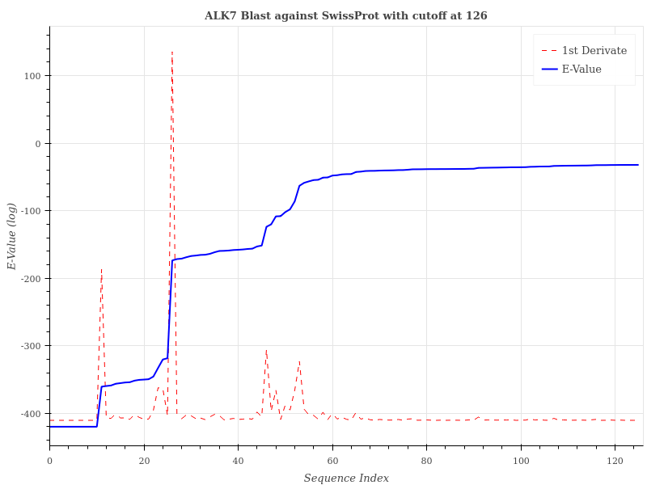

# Reporte de construcción de biblioteca de secuencias de AVCR

_Erwin Quiroga_

## Introducción

La busqueda de las secuencias se realizó usando BLAST de manera remota, usando el modulo `Bio.BLAST.NCBIWWW`. Los targets fueron obtenidos desde el Uniprot y se realizó el blastp contra la base de datos Swissprot.

| Proteina       | Codigo Uniprot |
|:--------------:|:--------------:|
| ALK1           | P37023         |
| ALK2           | Q04771         |
| ALK3           | P36894         |
| ALK4           | P36896         |
| ALK5           | P36897         |
| ALK6           | Q05438         |
| ALK7           | Q8NER5         |
| BMPR2          | Q13873         |
| ActR-IIA       | Q7SXW6         |
| ActR-IIB       | Q56A35         |
| TGFR2          | P37173         |
| AMH-RII        | Q16671         |
| EGFR (control) | P00533         |

El Blast se realizo con los siguientes parametros

|           Parametro            |   Valor   |
|:------------------------------:|:---------:|
|            Programa            |  Blastp   |
|         Base de datos          | SwissProt |
| Tolerancia (Corte del E-Value) |   0.01    |
|            Hitlist             |   2000    |

Los resultados de los BLAST fueron graficados en función del logaritmo del E-Value contra su posición en el listado de los hits, siguiendo el siguiente código:

```python
result_handle = open(blastfile)
record = NCBIXML.read(result_handle)
evalue=[]
for aln in record.alignments:
    hsp = aln.hsps[0]
    evalue.append(hsp.expect)
log_eval=[]
for i in evalue:
    if i == 0:
        log_eval.append(-400)
    else:
        log_eval.append(np.log(i))
d_eval= list(np.diff(log_eval))
d_eval.insert(0,d_eval[0])
index = list(range(len(evalue)))
```

Las secuencias fueron filtradas mediante un cutoff determinado según la posición del máximo valor de la primera derivada del logaritmo de E-value, siendo este calculado con el código anterior en la variable `d_eval`.

El código de filtración usado fue el siguiente, guardando el cutoff al primer cambio de sentido de la derivada después de 100 secuencias desde el valor máximo:
```python
cutoff_list = []
for data in datalist:
    d_max = max(data[1])
    index = data[1].index(d_max)
    print("maximun change is at",index,"with value of",d_max)
    d_data = data[1][index+1:]
    length=len(d_data)-1
    for i in range(length):
        if (d_data[i-1] < d_data[i] and d_data[i+1] < d_data[i]):
            index_d = data[1].index(d_data[i])
            if index_d - index < 100:
                continue
            else:
                break
    cutoff_list.append(index_d)
    print("break at",index_d)
```

Estos valores fueron cargados en la función graficadora, usando `bohek`
```python
def BLASTGraphicEval(blastfile,cutoff=False,cutoff_val=50):
    from Bio.Blast import NCBIXML
    from bokeh.models import ColumnDataSource, CDSView, BooleanFilter
    from bokeh.models import Title, LinearAxis, Range1d
    from bokeh.plotting import figure, show
    from bokeh.io import export_png
    import numpy as np

    #Extracting Evalues
    result_handle = open(blastfile)
    record = NCBIXML.read(result_handle)

    evalue=[]
    for aln in record.alignments:
        hsp = aln.hsps[0] #just first hsp to avoid multiple hit scanning
        val = hsp.expect
        evalue.append(hsp.expect)

    #Calulating log of Evalue
    log_eval=[]
    for i in evalue:
        if i == 0:
            log_eval.append(-420) #Arbitrary value, because log(0) is undefined
        else:
            log_eval.append(np.log(i))
    #Calculating Difference of Evalues (1st derivate)
    d_eval= list(np.diff(log_eval))
    d_eval.insert(0,d_eval[0]) #Adding first value as 0 to square up with the index
    index = list(range(len(evalue)))
    #print("Current lenght is",len(evalue))
    #Saving data in bokeh plot data
    data = {
        "index": index,
        "evalue": log_eval,
        "derivate": d_eval
    }
    source = ColumnDataSource(data=data)

    #Generating plot
    minY=min(data["derivate"])
    maxY=max(data["derivate"])
    name=blastfile.split("/")[1].split("_")[0]
    if cutoff:
        #Generating plot figure
        p = figure(plot_height=600, plot_width=800,
                   title="{0} Blast against SwissProt with cutoff at {1}".format(name,cutoff_val),
                   title_location="above", x_range=Range1d(start=0, end=cutoff_val),
                   toolbar_location=None)
        #Adding titles and labels
        p.title.align = "center"
        p.xaxis.axis_label = "Sequence Index"
        p.yaxis.axis_label = "E-Value (log)"
        #Filtering
        booleans = [True if index < cutoff_val else False for index in source.data['index']]
        view = CDSView(source=source, filters=[BooleanFilter(booleans)])
        #Plotting lines
        p.extra_y_ranges = {"linear": Range1d(start=minY-10, end=maxY+10)}
        p.line(x="index", y="derivate", source=source, line_width=1, line_color="red", view=view, y_range_name="linear", line_dash='dashed',legend="1st Derivate" )
        p.line(x="index", y="evalue", source=source, view=view, line_width=2, line_color="blue",legend="E-Value")
        #Export to file
        export_png(p, filename="Plots/plot_{}_cutoff.png".format(name))
    else:
        #Generating plot figure
        p = figure(plot_height=600, plot_width=800,
                   title="%s Blast against SwissProt"%(name), title_location="above",
                   toolbar_location=None)
        #Adding titles and labels
        p.title.align = "center"
        p.xaxis.axis_label = "Sequence Index"
        p.yaxis.axis_label = "E-Value (log)"
        #Plotting lines
        p.extra_y_ranges = {"linear": Range1d(start=minY-10, end=maxY+10)}
        p.line(x="index", y="derivate", source=source, line_width=2, line_color="red", y_range_name="linear", line_dash='dashed',legend="1st Derivate")
        p.line(x="index", y="evalue", source=source, line_width=2, line_color="blue",legend="E-Value")
        #Export to file
        export_png(p, filename="Plots/plot_{}.png".format(name))
```

Lo que generó los graficos del BLAST, siendo presentados los obtenidos con los cutoff previamente determinados

||
|:---:|
|_Blast de ALK1 conta SwissProt_|

||
|:---:|
|_Blast de ALK2 conta SwissProt_|

||
|:---:|
|_Blast de ALK3 conta SwissProt_|

||
|:---:|
|_Blast de ALK4 conta SwissProt_|

||
|:---:|
|_Blast de ALK5 conta SwissProt_|

||
|:---:|
|_Blast de ALK6 conta SwissProt_|

||
|:---:|
|_Blast de ALK7 conta SwissProt_|

La biblioteca de secuencias fue construida usando la función `FastaBuilder`, indicada a continuación, usando los cutoff para filtrar las secuencias.

```python
def FastaBuilder(blastfile,cutoff=50):
    import sys
    from Bio.Align import MultipleSeqAlignment
    #Inline progress bar
    def progressbar(it, prefix="", size=60, file=sys.stdout):
        count = len(it)
        def show(j):
            x = int(size*j/count)
            file.write("%s[%s%s] %i/%i\r" % (prefix, "#"*x, "."*(size-x), j, count))
            file.flush()        
        show(0)
        for i, item in enumerate(it):
            yield item
            show(i+1)
        file.write("\n")
        file.flush()

    i = 0
    ids = []
    name=blastfile.split("/")[1].split("_")[0]
    filename ="Sequence_Library/{0}.fa".format(name)
    if os.path.exists(filename):
        print("Saved File found, skipping...")
    else:    
        result_handle = open(blastfile)
        record = NCBIXML.read(result_handle)
        for alignment in record.alignments:
            for hsp in alignment.hsps:
                temp_str = alignment.title
                tag = temp_str.split("|")[1].split(".")[0]
                ids.append(tag)
                if i > cutoff:
                    break
                i +=1
        temp = []
        for i in progressbar(range(len(ids[:cutoff])), "Downloading:", 100):
            try:
                handle = ExPASy.get_sprot_raw(ids[i])
                seq = SeqIO.read(handle, "swiss")
                temp.append(seq)
            except ValueError:
                print("Culprit is",tag, "on position", ids.index(tag))
        print("Saving file...")
        SeqIO.write(temp, "Sequence_Library/{0}.fa".format(name), "fasta")
```
